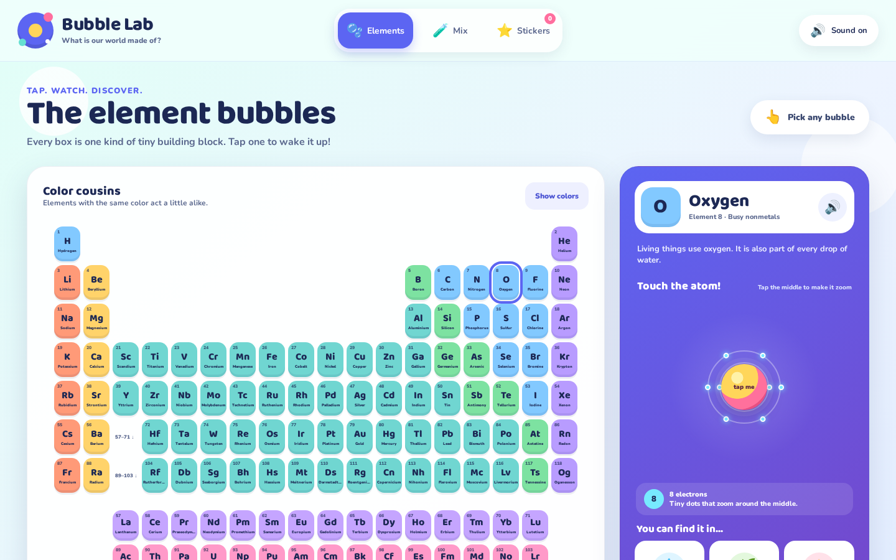
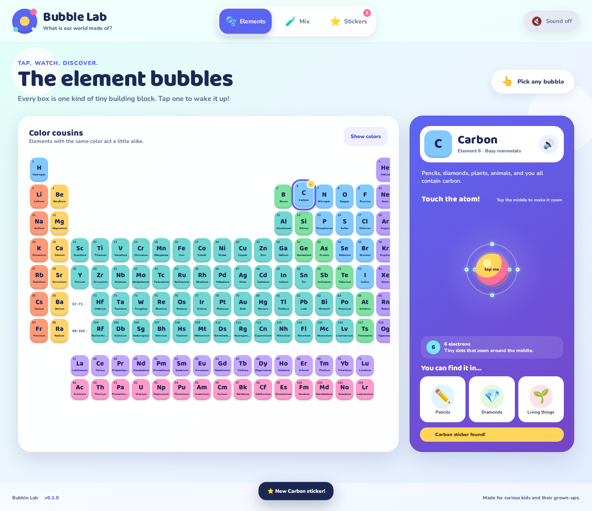
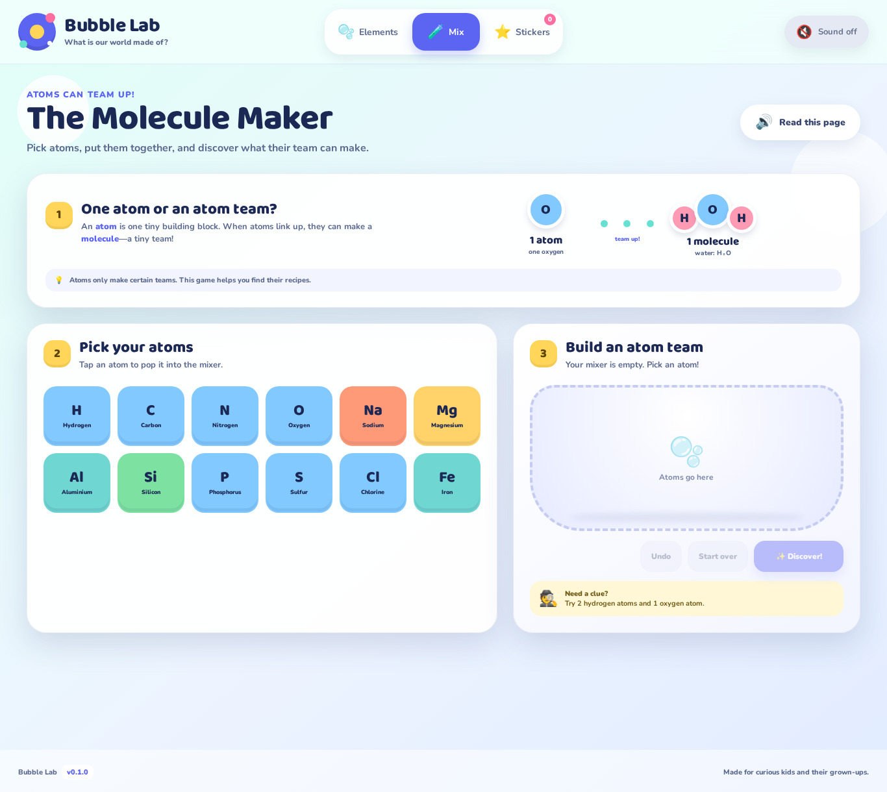
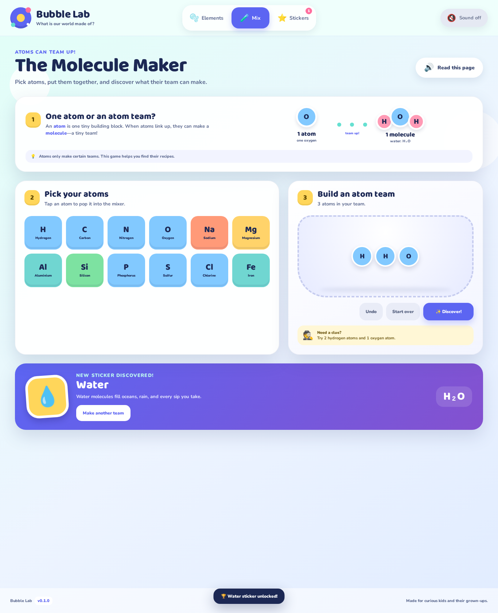
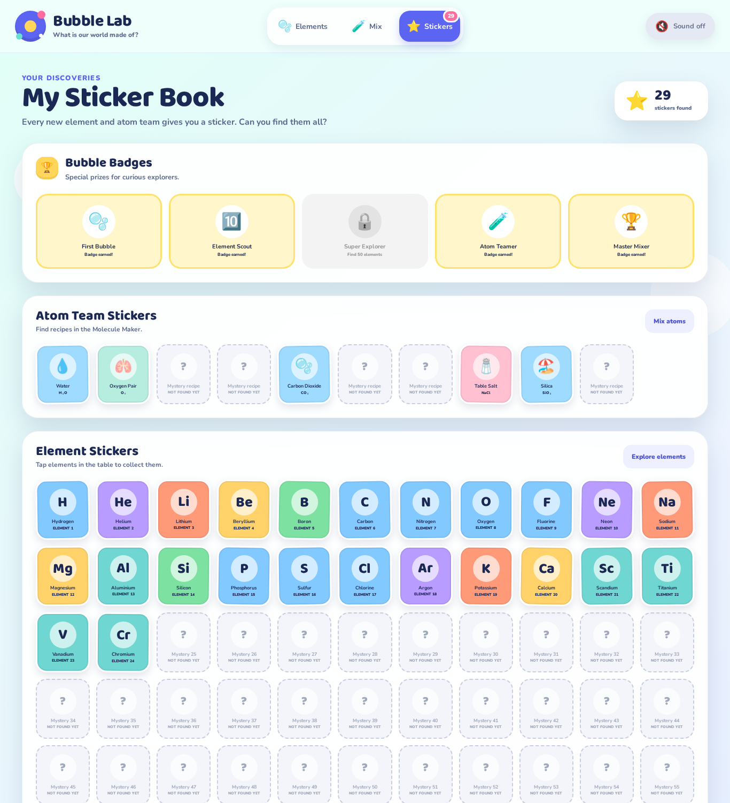
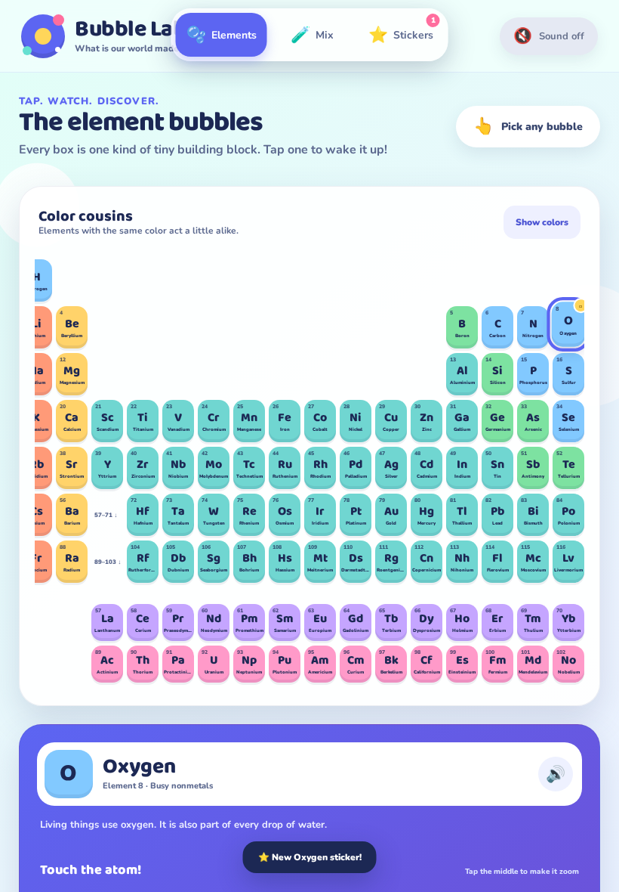

<div align="center">



# 🫧 Bubble Lab

### A periodic table children can touch, hear, mix, and collect.

[](https://github.com/regenerous/periodictableforkids/releases/tag/v0.1.0)
[](https://regenerous.github.io/periodictableforkids/)
[](#-made-for-young-explorers)
[](#-ipad-and-touch-friendly)

**[🚀 Open Bubble Lab](https://regenerous.github.io/periodictableforkids/)** · **[🧪 Try the Molecule Maker](https://regenerous.github.io/periodictableforkids/)**

</div>

---

## ⚡ Run it on your computer

Bubble Lab is a static website. There is **nothing to install inside the project**—no npm packages, database, account, or build step. You only need [Git](https://git-scm.com/downloads), [Python 3](https://www.python.org/downloads/), and a modern browser.

<table>
<tr>
<td width="33%" valign="top">

### 🪟 Windows

Open **PowerShell**:

```powershell
git clone https://github.com/regenerous/periodictableforkids.git
cd periodictableforkids
py -m http.server 4173
```

Open <http://localhost:4173>

</td>
<td width="33%" valign="top">

### 🍎 macOS

Open **Terminal**:

```bash
git clone https://github.com/regenerous/periodictableforkids.git
cd periodictableforkids
python3 -m http.server 4173
```

Open <http://localhost:4173>

</td>
<td width="33%" valign="top">

### 🐧 Linux

Open a **terminal**:

```bash
git clone https://github.com/regenerous/periodictableforkids.git
cd periodictableforkids
python3 -m http.server 4173
```

Open <http://localhost:4173>

</td>
</tr>
</table>

Press <kbd>Ctrl</kbd> + <kbd>C</kbd> in the terminal when you want to stop the local server.

> [!TIP]
> Want the easiest option? Skip local setup and use the **[live GitHub Pages site](https://regenerous.github.io/periodictableforkids/)**.

---

## 🌈 What is Bubble Lab?

Bubble Lab introduces the periodic table without turning it into a wall of difficult words. Children learn by tapping, watching, listening, experimenting, and earning rewards.

| 🫧 Explore | ⚛️ Watch | 🧪 Combine | ⭐ Collect |
|:--:|:--:|:--:|:--:|
| Tap all 118 elements | See electrons swirl | Build atom teams | Earn stickers and badges |
| Hear friendly explanations | Touch atoms to speed them up | Discover 10 recipes | Progress stays on the device |

## 🔎 Explore every element

Every colorful bubble is a large touch target. Tap an element to see its animated atom, hear its name, and discover three familiar things that contain or use it.



### How it works

1. **Tap an element bubble.** Its color group and sticker appear immediately.
2. **Touch the atom.** The electron shells speed up for a playful visual response.
3. **Press the speaker.** Bubble Lab reads a short, age-appropriate explanation aloud.
4. **Look at the object cards.** Pencils, plants, water, phones, bikes, and other familiar examples connect elements to everyday life.

> [!NOTE]
> The animation uses a simplified shell model so children can see and count electrons. Real electrons do not travel on tidy circular tracks.

## ⚛️ One atom or an atom team?

Before mixing anything, children see the difference between one atom and a molecule:

- An **atom** is one tiny building block.
- A **molecule** is a tiny team of atoms linked together.
- Atoms only form certain teams, so the activity uses discoverable recipes instead of pretending every mix works.



## 🧪 Make molecules and familiar compounds

Choose atom cards, pop them into the mixer, and press **Discover!** A correct recipe reveals a friendly explanation, formula, celebration, and collectible sticker.



### Recipes waiting to be discovered

| Formula | Discovery | Formula | Discovery |
|:--:|:--|:--:|:--|
| H₂O | 💧 Water | O₂ | 🫁 Oxygen pair |
| H₂ | 🎈 Hydrogen pair | N₂ | 🌬️ Nitrogen pair |
| CO₂ | 🫧 Carbon dioxide | CH₄ | 🔥 Methane |
| NH₃ | 🌱 Ammonia | NaCl | 🧂 Table salt |
| SiO₂ | 🏖️ Silica | Fe₂O₃ | 🔩 Rust |

The language stays simple, while the activity carefully calls salt, silica, and rust **atom teams** rather than incorrectly labeling every combination as a molecule.

## 🏆 Build a Sticker Book

Opening an element earns its sticker. Finding a recipe earns an Atom Team sticker. Larger milestones unlock Bubble Badges, turning exploration into a gentle Pokédex-style collection game.



Progress is stored with browser `localStorage`, so children can leave and continue later on the same device. No name, login, email address, analytics profile, or cloud account is required.

## 📱 iPad and touch friendly

<table>
<tr>
<td width="42%">



</td>
<td valign="top">

### Designed for small hands

- 👆 Large, forgiving touch targets
- ↔️ Natural horizontal table swiping
- 🧭 Three always-visible activity choices
- 🔊 Optional spoken guidance
- 🎉 Immediate visual feedback
- ♿ Keyboard focus and screen-reader labels
- 🌀 Reduced-motion support
- 📐 Responsive portrait and landscape layouts

</td>
</tr>
</table>

## 🧒 Made for young explorers

The first release targets ages **6–8**. Its content rules are intentionally strict:

- Short sentences and familiar words
- Visual demonstrations before explanations
- No quizzes that punish guessing
- Honest “scientists are still learning” language for rare elements
- Clear safety language for mercury, lead, and other hazardous elements
- Familiar illustrated objects instead of dense property tables
- Sounds and narration that can be turned off at any time

## 🛠️ Project design

Bubble Lab deliberately uses a tiny, dependable stack:

```text
periodictableforkids/
├── index.html                  # All three activity views
├── styles.css                  # Responsive Bubble Lab visual system
├── js/
│   ├── app.js                  # Interactions, narration, recipes, rewards
│   └── elements.js             # 118 elements and electron-shell counts
├── assets/                     # App icon
├── docs/readme/                # README walkthrough images
├── design/mockups/             # Original visual directions
├── tests/smoke.cjs             # Browser-DOM interaction test
├── manifest.webmanifest        # Add-to-home-screen metadata
└── .github/workflows/          # Tests and GitHub Pages deployment
```

- **Zero runtime dependencies**—plain HTML, CSS, and JavaScript
- **Web Speech API** for spoken explanations
- **Web Audio API** for soft interaction sounds
- **Local storage** for private, device-only progress
- **GitHub Actions** for automatic GitHub Pages publishing

## ✅ Test the project

Contributor tests use Node.js and jsdom; the website itself does not.

```bash
npm install
npm test
```

The smoke test verifies all 118 element tiles, activity navigation, every molecule recipe, and saved Sticker Book progress. The release data audit also checks atomic-number order, electron totals, unique table positions, and illustration coverage.

## 🚀 Releases and deployment

Every shipped version is recorded in four places:

- The [`VERSION`](VERSION) file
- The in-app footer
- The [`CHANGELOG.md`](CHANGELOG.md)
- A matching Git tag and GitHub Release

Pushing `main` runs the test workflow and publishes the site through GitHub Pages. The current release is **v0.1.0**.

## 📚 Data and science note

Periodic-table positions and electron-shell counts were derived from [Bowserinator/Periodic-Table-JSON](https://github.com/Bowserinator/Periodic-Table-JSON), released under CC0-1.0. All child-facing descriptions and everyday examples were written specifically for Bubble Lab.

---

<div align="center">

### ✨ The whole world is made of tiny building blocks. Let’s meet them!

**[Play Bubble Lab →](https://regenerous.github.io/periodictableforkids/)**

Made for curious kids and their grown-ups.

</div>
